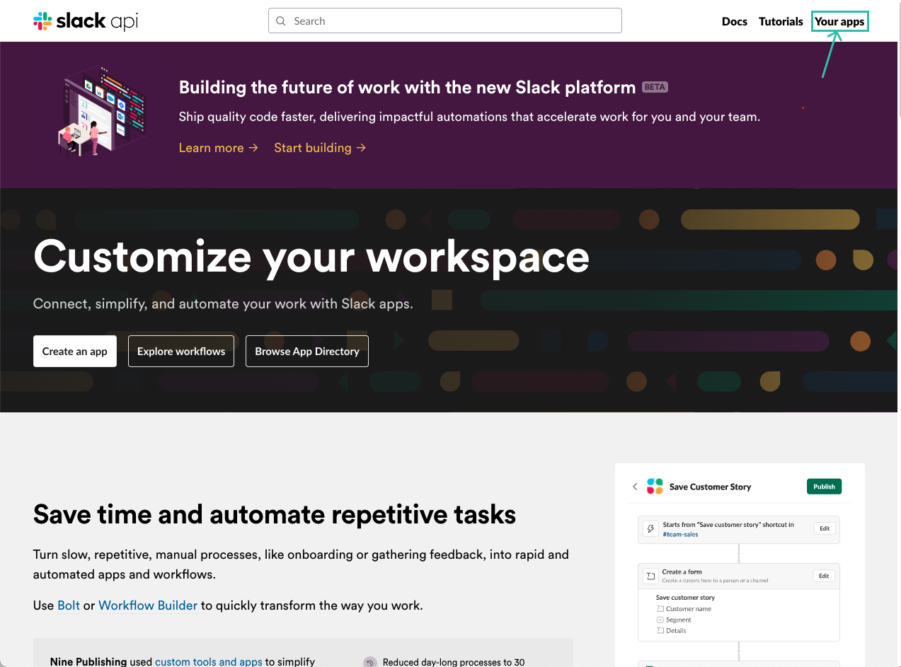

# How to integrate with Slack

**Feature toggle:** slack

---

Since OTS is a self-hosted solution, a Slack app needs to be created for your workspace with correct Webhook URLS.

### Creating an App

1. Go to https://api.slack.com
2. If not authenticated then authenticate and click on "Your apps"

3. Click on "Create New App > From an app manifest"
4. Select the workspace where you want to create your app on
5. Add manifest below in JSON format and replace all the values that are in `<>` and remove the brackets :
```json
{
    "display_information": {
        "name": "<YOUR_APP_NAME>"
    },
    "oauth_config": {
        "redirect_urls": [
            "<YOUR_APP_URL>"
        ],
        "scopes": {
            "user": [
                "chat:write",
                "channels:read",
                "users:read"
            ]
        }
    },
    "settings": {
        "org_deploy_enabled": false,
        "socket_mode_enabled": false,
        "token_rotation_enabled": true
    }
}
```
6. Review changes
   1. `<YOUR_APP_URL>` can be replace with the backend URL when running locally or with docker. Docker Example: `https://localhost:9011/integrations/slack/webhook`
7. Click "Create"
8. Congratulations you just created your Slack App for OTS
